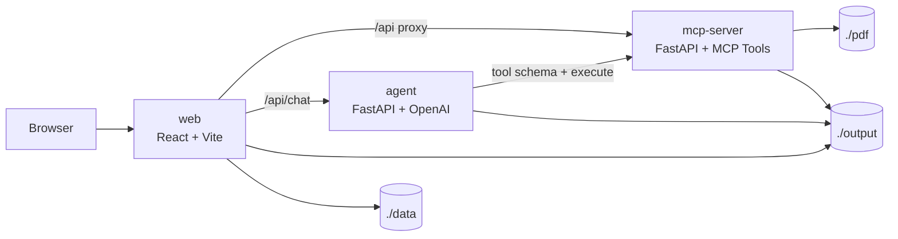

# Research Agent

로컬에서 실행하는 **MCP 기반 연구 워크스페이스**입니다.  

> **논문 검색 → 필터링/랭킹 → PDF 다운로드 → 텍스트/이미지 추출 → 섹션 분석 → 최종 리포트 생성 → 그래프 탐색 → 노트 저장/외부 연동**

현재 코드 기준으로 이 레포는 크게 세 계층으로 나뉩니다.

- **`mcp-server`**: 실제 도구 실행 계층. PDF 처리, arXiv 검색/다운로드, 랭킹, 리포트, Notion/Discord 연동, 백그라운드 파이프라인 API를 제공합니다.
- **`agent`**: OpenAI 기반 오케스트레이션 계층. MCP 도구 스키마를 읽고, 계획/도구 호출/응답 생성을 담당합니다.
- **`web`**: React/Vite UI. 그래프, 랭킹 리스트, 노트 페이지, 계정 설정, 채팅 팝업, 파이프라인 실행 화면을 제공합니다.

---

## 1. 이 프로젝트로 할 수 있는 일

### 1.1 논문 수집
- **arXiv 검색 / 상세 조회 / PDF 다운로드**
- **NeurIPS 2025 / ICLR 2025** 논문 탐색 및 랭킹
- 로컬 `./pdf/` 폴더에 넣은 PDF를 바로 분석 대상으로 사용

### 1.2 PDF 처리
- PDF 목록 조회
- 텍스트 추출
- 이미지 추출
- 텍스트+이미지 통합 추출(`extract_all`)
- 전체 PDF 일괄 처리(`process_all_pdfs`)
- PDF 메타데이터 조회
- 추출 텍스트 재로딩
- 추출 텍스트에서 GitHub 링크 자동 탐지

### 1.3 사용자 맞춤 랭킹
- 사용자 프로필(`users/profile.json`) 기반 추천
- 하드 필터:
  - 이미 읽은 논문 제외
  - 블랙리스트 키워드 제외
  - 연도 조건 필터링
- 시맨틱 유사도 계산
- 6차원 메트릭 평가
- 최종 Top-K 선정
- 필요 시 contrastive paper 추천

### 1.4 자동 분석 파이프라인
- **로컬 PDF 파이프라인**: 선택한 PDF들을 백그라운드에서 분석
- **컨퍼런스 파이프라인**: arXiv 또는 NeurIPS에서 검색→랭킹→다운로드→추출→분석을 자동 실행
- 분석 모드:
  - `quick`
  - `standard`
  - `deep`

### 1.5 리포트 / 섹션 분석 / QA
- 전체 요약 리포트 생성
- 섹션 헤딩 추출
- 전략 기반 섹션 선택
- 섹션별 분석
- 논문 QA
- 최종 종합 리포트 생성
- Discord full/summary 알림 전송

### 1.6 그래프 탐색
- **Global Paper Graph**
- **Paper Reference Graph**
- 기존 노드에 점진적으로 reference subgraph를 확장하는 방식 지원

### 1.7 노트 워크스페이스
- 논문별 노트 페이지
- 섹션별 노트
- 번역 / 분석 / QA 결과를 별도 페이지 상태로 저장
- 자동 저장(localStorage + 파일 시스템)
- Notion으로 저장 가능

### 1.8 외부 연동
- **OpenAI API**: 에이전트 추론, 번역, 리포트, 채팅
- **Tavily API**: 실시간 웹 검색
- **Notion OAuth**: 노트 저장
- **Discord Webhook**: full/summary 알림

### 1.9 관측성과 저장
- 프롬프트/응답 JSONL 로깅
- `output/agent_status/*.json` 상태 파일
- `output/agent_reports/` 최종 리포트
- 논문별 출력 산출물 영속화

---

## 2. 아키텍처



### 요청 흐름 요약

1. 사용자는 `http://localhost:3000`에서 UI를 엽니다.
2. 웹 UI는 대부분의 작업을 `'/api' -> mcp-server`로 프록시합니다.
3. 채팅은 `'/api/chat'`을 통해 `research-agent:8001/chat`으로 전달됩니다.
4. Agent는 MCP 서버의 `/tools/schema`를 읽고, 필요한 도구를 호출하며 응답을 생성합니다.
5. 산출물은 `./output/` 아래에 누적 저장됩니다.

---

## 3. 레포 구조

```text
Research_agent/
├─ agent/               # LLM 오케스트레이션 계층
│  ├─ client.py         # OpenAI 툴 호출 루프
│  ├─ server.py         # /chat, /health FastAPI 서버
│  ├─ planner.py        # 계획 생성
│  ├─ executor.py       # 의존성 기반 실행기
│  └─ memory.py         # 대화/툴 호출/플랜 상태 저장
├─ mcp/                 # MCP 도구와 서버
│  ├─ server.py         # /tools, /pdf/*, /agent/*, /notion/* 등
│  ├─ registry.py       # mcp/tools 자동 발견/등록 SSOT
│  └─ tools/            # PDF, arXiv, rank, graph, notion, web search 등
├─ web/                 # React + Vite 프론트엔드
│  ├─ pages/            # Home / Graph / Note / ICLR / NeurIPS 페이지
│  ├─ components/       # 사이드바, 랭킹 리스트, 채팅, 계정 설정 등
│  ├─ lib/mcp.ts        # MCP REST client
│  └─ vite.config.ts    # /api 프록시 + 로컬 파일/메타데이터 미들웨어
├─ data/                # 컨퍼런스 CSV, 사전 계산된 임베딩/유사도/클러스터
├─ instruction/         # 도구/파이프라인 문서
├─ pdf/                 # 입력 PDF 저장소
├─ output/              # 추출/리포트/상태/프로필/런타임 설정 저장
├─ runtime/             # 서비스 설정 로딩 코드
├─ logs/                # LLM 프롬프트/응답 로그
├─ tests/               # 통합/랭킹/번역 테스트
├─ requirements/        # Python requirements 분리
├─ docker/              # 각 서비스용 Dockerfile 및 엔트리포인트
└─ docker-compose.yml   # 3개 서비스 스택 정의
```

---

## 4. Docker로 실행하기

## 4.1 사전 준비

필수:
- Docker Engine + Docker Compose v2
- OpenAI API Key

선택:
- Tavily API Key (실시간 웹 검색이 필요할 때)
- Notion 연결
- Discord Webhook

---

## 4.2 빌드

```bash
docker compose build
```

---

## 4.3 최소 스택 실행

```bash
docker compose up -d mcp-server web
```

이 조합으로 가능한 것:
- PDF 처리
- 그래프 탐색
- 랭킹 페이지
- 노트/리포트 UI
- 계정 설정
- 대부분의 MCP 직접 호출 기반 기능

주의:
- **채팅 팝업은 `agent` 서비스가 없으면 동작하지 않습니다.**
- UI는 열리지만, `/api/chat`은 Agent 서버에 포워딩되므로 agent 컨테이너가 내려가 있으면 채팅 응답에 unavailable 메시지가 뜹니다.

---

## 4.4 전체 스택 실행

```bash
docker compose up -d mcp-server web agent
```

또는 이미 최소 스택을 올렸다면:

```bash
docker compose up -d agent
```

---

## 4.5 상태 확인

```bash
docker compose ps
docker compose logs -f mcp-server
docker compose logs -f web
docker compose logs -f agent
```

헬스체크:

```bash
curl http://localhost:8000/health
curl http://localhost:8000/tools
curl http://localhost:8000/tools/schema
curl http://localhost:8001/health
```

---

## 4.6 첫 실행 후 해야 할 일

1. 브라우저에서 `http://localhost:3000` 접속
2. 우상단 **Account** 버튼 클릭
3. 필요한 키 저장
   - OpenAI API Key
   - Tavily API Key (선택)
4. 필요하면 Notion 연결
5. 필요하면 Discord webhook 저장

### 런타임 자격 증명 저장 방식

비밀 키는 `.env`에서 읽지 않습니다.  
웹 UI에서 저장한 값은 아래 파일에 저장됩니다.

```text
output/_runtime/service_settings.json
```

특징:
- MCP 서버와 Agent가 **런타임에 이 파일을 읽음**
- 저장 후 **재시작이 필요 없음**
- Git에 커밋하지 않는 것이 맞음

---

## 4.7 PDF 넣기

분석할 PDF를 아래 폴더에 넣습니다.

```text
./pdf/
```

하위 폴더도 사용할 수 있습니다.  
예: `./pdf/neurips2025/*.pdf`

---

## 4.8 중지

```bash
docker compose down
```

출력 산출물(`./output`)과 입력 PDF(`./pdf`)는 bind mount이므로 유지됩니다.

---

## 5. docker-compose 구성 상세

| 서비스 | 포트 | 역할 | 주요 볼륨 |
|---|---:|---|---|
| `mcp-server` | `8000` | 도구 실행 / REST API / 백그라운드 잡 시작점 | `./pdf`, `./output`, `./tests`, `./data` |
| `agent` | `8001` | OpenAI 기반 에이전트 채팅/도구 오케스트레이션 | `./pdf:ro`, `./output:ro` |
| `web` | `3000` | React/Vite UI | `./web`, `./output`, `./pdf:ro`, `./data:ro`, `web_node_modules` |

### 내부 설정 포인트
- `mcp-server`
  - `PDF_DIR=/data/pdf`
  - `OUTPUT_DIR=/data/output`
  - 헬스체크 포함
- `agent`
  - `MCP_SERVER_URL=http://mcp-server:8000`
  - `mcp-server` 헬스 후 기동
- `web`
  - `MCP_SERVER_URL=http://mcp-server:8000`
  - `npm install`이 필요하면 자동 수행 후 `npm run dev`

### 베이스 이미지
- `mcp-server`: `python:3.11-slim`
- `agent`: `python:3.11-slim`
- `web`: `node:20-alpine`

---

## 6. 실행 후 사용 시나리오

## 6.1 로컬 PDF 워크플로우

### A. 기본 흐름
1. `./pdf/`에 논문 PDF를 넣음
2. UI에서 해당 논문 열기
3. 필요 시 `process_all_pdfs` 또는 개별 추출 실행
4. Note 페이지에서 섹션 헤딩 추출
5. 번역/분석/QA/리포트 생성
6. 결과를 로컬 파일 및 Notion에 저장

### B. 직접 API 호출 예시

PDF 목록:

```bash
curl http://localhost:8000/pdf/list
```

개별 PDF 추출:

```bash
curl -X POST "http://localhost:8000/pdf/extract?filename=your_paper.pdf"
```

전체 PDF 일괄 처리:

```bash
curl http://localhost:8000/pdf/process-all
```

### C. Note 페이지 동작
- `NotePage`는 논문별 노트 워크스페이스입니다.
- 추출 텍스트에서 **정규식 기반으로 목차/소목차를 추출**합니다.
- 정규식 실패 시 **채팅(`/api/chat`)을 이용한 LLM fallback**이 있습니다.
- 노트는:
  - localStorage에 캐시되고
  - 파일 시스템에도 자동 저장됩니다.
- 노트 페이지 상태는 `manual`, `translation`, `analysis`, `qa`처럼 분리되어 관리됩니다.

---

## 6.2 arXiv 검색/랭킹 워크플로우

### A. 추천 순서
1. 사용자 프로필 설정
2. arXiv 검색
3. 하드 필터 적용
4. semantic score 계산
5. paper metrics 평가
6. 최종 Top-K 랭킹
7. 필요 시 다운로드/분석

### B. 직접 API 예시

arXiv 검색을 랭킹용 입력 형식으로 변환:

```bash
curl -X POST http://localhost:8000/arxiv/search-for-ranking \
  -H "Content-Type: application/json" \
  -d '{
    "query": "diffusion policy",
    "max_results": 50
  }'
```

풀 랭크 파이프라인:

```bash
curl -X POST http://localhost:8000/rank-filter/execute-pipeline \
  -H "Content-Type: application/json" \
  -d '{
    "query": "diffusion policy",
    "max_results": 50,
    "purpose": "general",
    "ranking_mode": "balanced",
    "top_k": 5,
    "include_contrastive": false,
    "contrastive_type": "method",
    "profile_path": "users/profile.json"
  }'
```

### C. 추천 프로필 필드
사용자 프로필은 아래 정보를 다룹니다.

- `interests.primary`
- `interests.secondary`
- `interests.exploratory`
- `keywords.must_include`
- `keywords.exclude.hard`
- `keywords.exclude.soft`
- `preferred_authors`
- `preferred_institutions`
- `constraints.min_year`
- `constraints.require_code`
- `constraints.exclude_local_papers`
- `purpose`
- `ranking_mode`
- `top_k`
- `include_contrastive`
- `contrastive_type`

### D. `purpose` 가이드
- `general`: 일반적인 추천
- `literature_review`: 서베이/관련연구 조사
- `implementation`: 구현 가능성 중시
- `idea_generation`: 최신성/탐색성 중시

### E. `ranking_mode` 가이드
- `balanced`
- `novelty`
- `practicality`
- `diversity`

### F. `contrastive_type` 가이드
- `method`
- `assumption`
- `domain`

---

## 6.3 NeurIPS 2025 / ICLR 2025 워크플로우

### UI 라우트
- `http://localhost:3000/neurips2025`
- `http://localhost:3000/iclr2025`

### 특징
- 컨퍼런스 전용 검색/랭킹 페이지가 따로 존재합니다.
- `./data/` 아래의 CSV와 사전 계산된 embedding/similarity/cluster 데이터를 활용합니다.
- UI는 `/api/neurips/papers`, `/api/neurips/similarities`, `/api/neurips/clusters`, `/api/iclr/papers`, `/api/iclr/similarities`, `/api/iclr/clusters`를 사용합니다.

### NeurIPS / ICLR 랭킹 파이프라인 내부 논리
두 페이지 모두 대체로 아래 순서를 사용합니다.

1. 컨퍼런스 검색
2. `apply_hard_filters`
3. `calculate_semantic_scores`
4. `evaluate_paper_metrics`
5. `rank_and_select_top_k`

즉, 단순 CSV 정렬이 아니라 **프로필 기반 랭킹 파이프라인**이 붙어 있습니다.

---

## 6.4 백그라운드 연구 에이전트 파이프라인

## A. 로컬 PDF 분석 파이프라인

선택한 로컬 PDF들에 대해 백그라운드 분석 시작:

```bash
curl -X POST http://localhost:8000/agent/run \
  -H "Content-Type: application/json" \
  -d '{
    "arguments": {
      "paper_ids": ["your_paper.pdf"],
      "goal": "general understanding",
      "analysis_mode": "quick",
      "source": "local",
      "discord_webhook_full": "",
      "discord_webhook_summary": ""
    }
  }'
```

반환:
- `job_id`
- 상태 URL

## B. 컨퍼런스 파이프라인

arXiv 또는 NeurIPS 대상:

```bash
curl -X POST http://localhost:8000/agent/conference-pipeline \
  -H "Content-Type: application/json" \
  -d '{
    "source": "arxiv",
    "query": "transformer attention",
    "top_k": 3,
    "goal": "latest methods overview",
    "analysis_mode": "standard",
    "discord_webhook_full": "",
    "discord_webhook_summary": "",
    "profile_path": "users/profile.json"
  }'
```

주의:
- `source`는 현재 `arxiv` 또는 `neurips`
- 서버에서 `top_k`는 **1~5 사이로 clamp**
- 응답은 즉시 반환되고, 실제 처리는 백그라운드에서 진행

## C. 상태 확인

```bash
curl http://localhost:8000/agent/status/<job_id>
curl http://localhost:8000/agent/jobs
```

### 내부 처리 단계
로컬/컨퍼런스 파이프라인은 대체로 아래 과정을 거칩니다.

1. 입력 논문/검색결과 준비
2. PDF 추출(`extract_all`)
3. 전체 리포트 생성(`generate_report`)
4. abstract/section 추출
5. 분석 전략 결정
6. 전략 기반 섹션 분석
7. executive summary 생성
8. 최종 report 조립
9. `output/agent_reports/` 저장
10. Discord full/summary 전송(설정되어 있으면)

### 전략 유형 예
- `experiment_focused`
- `methodology_focused`
- `formula_heavy`
- `implementation_focused`
- `comparison_focused`

---

## 6.5 채팅

웹 UI의 **LLM Chat Popup**은 연구 조수 역할을 합니다.

가능한 용도:
- 논문 비교
- 다음에 읽을 논문 추천
- 특정 주제 요약
- 섹션/실험 해석
- 목차 추출 fallback

### 중요한 점
- 채팅은 `/api/chat`을 통해 **`research-agent:8001/chat`** 으로 전달됩니다.
- 따라서 **`agent` 컨테이너가 반드시 실행 중이어야 합니다.**

---

## 6.6 그래프 탐색

### A. Global Graph
라우트:
- `/graph`

기능:
- 전체 논문 그래프 로딩
- graph/list 뷰 전환
- 전역 그래프 재구성

### B. Paper Graph
라우트:
- `/paper/:paperId`

기능:
- 특정 논문 중심 reference subgraph 생성
- 기존 노드에 대해 incremental expand 지원
- 논문별 reference 관련 산출물(`reference_titles.json` 등) 활용

---

## 6.7 리포트 뷰어

UI에는 `ReportViewer`가 있습니다.

흐름:
1. `get_report`
2. 없으면 `generate_report`
3. 다시 `get_report`
4. 존재하면 표시

즉, 리포트가 아직 없으면 **조회 시점에 자동 생성**될 수 있습니다.

---

## 6.8 Notion 연동

### 연결
- Account 모달에서 Notion OAuth 시작
- 팝업 기반 연결 완료
- 연결 상태는 런타임 설정 파일에 저장

### 제공 API
- `/notion/status`
- `/notion/oauth/start`
- `/notion/oauth/callback`
- `/notion/disconnect`
- `/notion/pages/search`
- `/notion/pages`
- `/notion/save`

### 주요 사용처
- Note 페이지의 `NotionSaveModal`
- 특정 논문 노트를 기존 페이지에 append 또는 새 페이지로 저장

---

## 6.9 Discord 알림

Discord 설정은 런타임 저장 방식으로 관리됩니다.

API:
- `GET /config/discord`
- `POST /config/discord`

파이프라인 인자:
- `discord_webhook_full`
- `discord_webhook_summary`

용도:
- 긴 full report 전송
- 짧은 summary report 전송

추가로 notification 도구를 통해 테스트 전송도 가능합니다.

---

## 7. 웹 애플리케이션 라우트

현재 `web/App.tsx` 기준 주요 라우트:

| 라우트 | 화면 |
|---|---|
| `/` | HomePage |
| `/graph` | GlobalGraphPage |
| `/paper/:paperId` | PaperGraphPage |
| `/neurips2025` | NeurIPS2025Page |
| `/iclr2025` | ICLR2025Page |
| `/note/:paperId` | NotePage |

공통 컴포넌트:
- `NavBar`
- `LLMChatPopup`
- `PipelineModal`
- `AccountSettingsModal`

---

## 8. 웹 서버의 프록시 / 로컬 파일 서빙 방식

`web/vite.config.ts`는 단순 Vite 설정이 아니라, 실제 워크스페이스 동작에 중요한 미들웨어를 포함합니다.

### 8.1 프록시
- `'/api'` → `MCP_SERVER_URL` (기본 `http://localhost:8000`)
- 경로 rewrite: `/api/foo` → `/foo`

### 8.2 별도 미들웨어
- `POST /api/chat` → `http://research-agent:8001/chat`
- `GET /api/neurips/papers`
- `GET /api/neurips/similarities`
- `GET /api/neurips/clusters`
- `GET /api/iclr/papers`
- `GET /api/iclr/similarities`
- `GET /api/iclr/clusters`
- `GET /output/*` → `/app/output` 파일 직접 서빙
- `GET /pdf/*` → `/app/pdf` 파일 직접 서빙

즉, 웹 컨테이너는 단순 정적 프런트엔드가 아니라,
**컨퍼런스 메타데이터와 로컬 산출물을 함께 제공하는 개발 서버** 역할을 합니다.

---

## 9. MCP 서버 API 개요

### 9.1 도구 스키마/실행
- `GET /`
- `GET /health`
- `GET /tools`
- `GET /tools/schema`
- `GET /tools/{tool_name}`
- `POST /tools/{tool_name}/execute`

### 9.2 PDF
- `GET /pdf/list`
- `POST /pdf/extract`
- `GET /pdf/process-all`

### 9.3 arXiv
- `GET /arxiv/search`
- `POST /arxiv/search-for-ranking`

### 9.4 리포트 / 해석
- `GET /reports/{paper_id}`
- `POST /paper/interpret`

### 9.5 Agent / Background job
- `POST /agent/run`
- `POST /agent/conference-pipeline`
- `GET /agent/status/{job_id}`
- `GET /agent/jobs`

### 9.6 Rank filter
- `GET /rank-filter/profile`
- `POST /rank-filter/profile`
- `POST /rank-filter/execute-pipeline`

### 9.7 Credentials / Notion / Discord
- `GET /config/credentials`
- `POST /config/credentials`
- `GET /config/discord`
- `POST /config/discord`
- `GET /notion/status`
- `GET /notion/oauth/start`
- `POST /notion/disconnect`
- `GET /notion/pages/search`
- `GET /notion/pages`
- `POST /notion/save`

---

## 10. Agent 내부 구조

`agent/`는 단순 REST wrapper가 아니라, 별도 오케스트레이션 레이어입니다.

### 구성 요소
- `AgentClient`
- `Memory`
- `Planner`
- `Executor`

### 동작 방식
1. MCP 서버의 `/tools/schema`에서 도구 정의 로드
2. OpenAI에 시스템 프롬프트 + 툴 스키마 전달
3. LLM이 도구 호출을 선택
4. Agent가 MCP에 실제 실행 요청
5. 결과를 다시 LLM에 전달
6. 최종 응답 반환

### 내부 상태 관리
- 대화 이력
- 도구 호출 이력
- 현재 플랜
- intermediate result
- context

### 모델
현재 코드상 기본 모델은 `gpt-4o`입니다.

---

## 11. MCP 도구 인벤토리

## 11.1 문서화된 핵심 도구

### PDF 관련
- `list_pdfs`
- `extract_text`
- `extract_images`
- `extract_all`
- `process_all_pdfs`
- `get_pdf_info`
- `read_extracted_text`
- `check_github_link`

### arXiv 관련
- `arxiv_search`
- `arxiv_get_paper`
- `arxiv_download`

### 웹 검색 관련
- `web_search`
- `web_get_content`
- `web_research`

### 랭킹 관련
- `update_user_profile`
- `apply_hard_filters`
- `calculate_semantic_scores`
- `evaluate_paper_metrics`
- `rank_and_select_top_k`

### 연구 에이전트 파이프라인 관련
- `run_research_agent`
- `run_conference_pipeline`
- `extract_paper_sections`
- `generate_report`
- `analyze_section`
- `paper_qa`
- `send_discord_notification`

---

## 11.2 `mcp/tools/`에 존재하는 도구 모듈

현재 `mcp/tools/` 디렉터리에는 아래 모듈들이 있습니다.

- `arxiv.py`
- `chapter_headings.py`
- `iclr_pipeline.py`
- `iclr_search.py`
- `neurips2025_pdf.py`
- `neurips_adapter.py`
- `neurips_pipeline.py`
- `neurips_search.py`
- `notification.py`
- `notion.py`
- `page_analyzer.py`
- `paper_graph.py`
- `pdf.py`
- `podcast.py`
- `rag_qa.py`
- `rank_filter.py`
- `refer.py`
- `report.py`
- `research_agent.py`
- `servey.py`
- `translate.py`
- `web_search.py`

> 정확한 등록 결과와 파라미터 스키마는 **런타임 기준 `/tools` 와 `/tools/schema`가 source of truth** 입니다.  
> `mcp/registry.py`가 이 디렉터리의 도구를 자동으로 발견/등록합니다.

---

## 12. 데이터와 출력 산출물

## 12.1 입력
```text
pdf/
```

## 12.2 런타임 설정
```text
output/_runtime/service_settings.json
```

## 12.3 논문별 산출물 예
일반적으로 아래와 같은 파일이 생성될 수 있습니다.

```text
output/<paper_id>/
├─ extracted_text.json
├─ extracted_text.txt
├─ image_metadata.json
├─ images/
├─ notes 관련 파일
├─ report 관련 파일
└─ reference/graph 관련 파일
```

## 12.4 에이전트 산출물
```text
output/agent_reports/
output/agent_status/
```

## 12.5 랭킹/프로필/사용자 상태
```text
output/rankings/
output/users/
```

## 12.6 프롬프트 로그
```text
logs/prompts/*.jsonl
```

---

## 13. 개발/디버깅

## 13.1 테스트 실행

`mcp-server` 이미지에는 pytest 관련 의존성이 포함되어 있으므로 컨테이너 안에서 실행할 수 있습니다.

```bash
docker compose exec mcp-server pytest tests -q
```

현재 테스트 파일:
- `tests/test_neurips_integration.py`
- `tests/test_rank_filter.py`
- `tests/test_translate.py`

## 13.2 프롬프트 로그 확인
모델 호출은 카테고리별 JSONL로 남습니다.

```text
logs/prompts/
```

## 13.3 도구 스키마 확인
런타임에 어떤 도구가 실제 등록되었는지 보려면:

```bash
curl http://localhost:8000/tools
curl http://localhost:8000/tools/schema
```

---

## 14. 트러블슈팅

### 문제 1. 웹은 열리는데 채팅이 안 된다
원인:
- `agent` 컨테이너가 실행 중이 아님

해결:
```bash
docker compose up -d agent
curl http://localhost:8001/health
```

### 문제 4. PDF는 넣었는데 UI에서 못 찾는다
확인:
- 파일이 실제로 `./pdf/` 아래 있는지
- 확장자가 `.pdf`인지
- 컨테이너 마운트가 정상인지
- `curl http://localhost:8000/pdf/list` 결과에 보이는지

### 문제 5. 노트/리포트/그래프 파일이 안 보인다
확인:
- `./output/`에 파일이 생성되는지
- 웹 컨테이너가 `/output`을 서빙 중인지
- 브라우저에서 `/output/...` 경로가 404인지

### 문제 6. 컨퍼런스 페이지에서 유사도/클러스터가 비어 있다
확인:
- `./data/embeddings_Neu/`
- `./data/embeddings_ICLR/`
- 관련 JSON 파일이 존재하는지

### 문제 7. 웹 의존성 문제가 있다
해결:
```bash
docker compose build web
docker compose up -d web
```

웹 엔트리포인트는 `node_modules`가 없거나 일부 패키지가 빠지면 자동으로 `npm install`을 수행합니다.

---

## 15. 보안 / Git 운영 주의

다음 경로는 커밋하지 않는 것이 맞습니다.

```text
output/_runtime/
```

이 안에는 다음이 포함될 수 있습니다.
- OpenAI API Key
- Tavily API Key
- Notion OAuth state/connection
- Discord webhook 설정

---

## 16. 현재 구조 요약

**Research Agent는 로컬 Docker 환경에서 실행되는 논문 연구 워크스페이스로, MCP 도구 서버(`mcp-server`), OpenAI 오케스트레이터(`agent`), React UI(`web`)를 결합해 검색·랭킹·다운로드·추출·분석·리포트·그래프·노트·외부 연동을 하나의 흐름으로 제공한다.**
